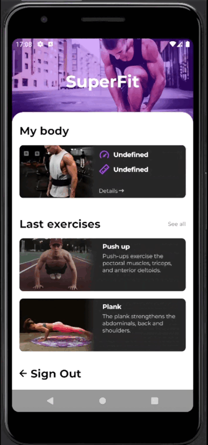

# SuperFit

Учебный проект второго курса HITs TSU. [Api](http://fitness.wsmob.xyz:22169/?urls.primaryName=Fitness#/) было подготовленно преподавателями.  
Мобильное приложени-фитнес трекер, функционал:
- Авторизация
- Ведение истории роста/веса
- Ведение истории подходов упражнений
- Загрузка фото
- Просмотр статистики

Используемые библиотеки:
- [Jetpack Compose Toolkit](https://developer.android.com/jetpack/compose)
- [Koin compose](https://insert-koin.io/docs/quickstart/android-compose/)
- [Navigation Compose](https://developer.android.com/jetpack/compose/navigation)
- [Retrofit](https://square.github.io/retrofit/)
- [Security crypto](https://developer.android.com/jetpack/androidx/releases/security)
- [Oribital](https://github.com/skydoves/Orbital) - Анимация перемешивания пароля
- [EasyPermissions-ktx](https://github.com/vmadalin/easypermissions-ktx) - упрощение получение доступа к физическому шагомеру

Особенности:
- MVI (Clean Architecture)
- Работа с акселерометром, шагомером
- Интересная графика экранов Train progress и Statistics

Работа с датчиками:
- Подразумевается, что при приседании, пользователь держит телефон перед собой вертикально, движение идёт по оси Y
- При отжимании - телефон лежит на спине пользователя, движение по оси Z
- Для бега использовался физический шагомер устройства (на видео запись с устройства, т.к. эмулятор не имеет этот датчик)

Визуальная составляющая:

|  Splash & Login  |  Register  |  Main Screen & All exercises  |
|:---|:---|:---|
|    |    |    |

|  My body  |  Image list & image  |  Train progress  |
|:---|:---|:---|
|    |    |    |

|  Statistics  |  Graph with a lot of information  |  Push up (с изменением положения по оси Z)  |
|:---|:---|:---|
|    |    |    |

|  Squats (с изменением положения по оси Y)  |  Plank  |  Crunch  |
|:---|:---|:---|
|    |    |    |

| Running  |
|---|
|   |
